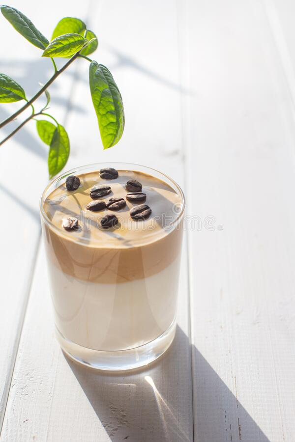

<!DOCTYPE html>
<html lang="en" dir="ltr">
  <head>
    <meta charset="UTF-8">
    <title>Home</title>
    <meta name="viewport" content="width=device-width, initial-scale=1.0">
    <link rel="stylesheet" href="home.css">
    <link rel="stylesheet" href="https://cdnjs.cloudflare.com/ajax/libs/font-awesome/5.15.2/css/all.min.css"/>
   </head>
<body>
  

 <!--Image Resource: https://www.dreamstime.com/traditional-korean-drink-caffeine-dalgona-coffee-transparent-glass-white-board-background-milk-whipped-image197494511 -->
  

    
Start the day with a Coffee.

    
Coding for Life.

    

        <button type="submit"><a href="resume.html" style="text-decoration: none; color: black;">Let's GO!</a></button>
    
 
  

</body>
</html>
